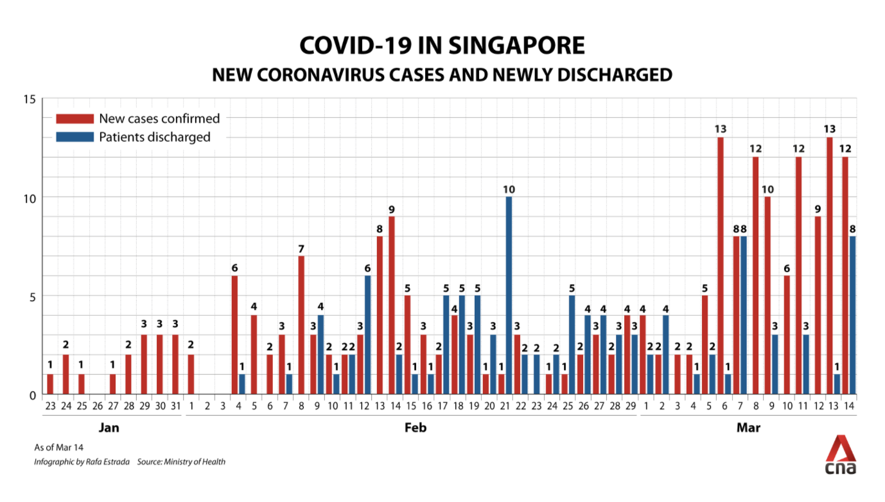
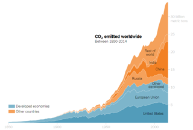

```{r setup, include=FALSE}
## **DO NOT EDIT THIS CODE CHUNK**
knitr::opts_chunk$set(echo = TRUE)

#run install.packages("cherryblossom") on the console to get the run17 dataset

library(tidyverse)
library(cherryblossom)  
```


## Exercise 1

There are 19,961 runners in this data set, with 9 variables each. The net_sec 
variable gives the total time taken to complete the race, in seconds, once their 
run-time has been adjusted for the staggered starting times. The event variable 
refers to the type of race each individual has run, either a 10 mile or 5k.

## Exercise 2

```{r run17_data_viz, warning = FALSE, out.width = "80%"}
ggplot(data = run17, 
       mapping = aes(x = sex, y = net_sec), stat = "identity") +
  geom_boxplot() +
  facet_wrap(~event) +
  labs(x = "Gender", y = "Total Running Time (s)")
```


## Exercise 3

Both graphs show the distribution of running times, per gender. The visualization
is faceted into two separate graphs based off of the event variable. This is to 
break down the running times per race, which is important because of the 
significant difference in the length (and hence expected time for completion) of 
both races.

## Exercise 4

```{r bad_viz, echo = FALSE, out.width = "80%"}
# edit the file path accordingly

```


{Stephen Tracy/Analythical}, "Analythical" [Online]. Available at: {https://analythical.com/blog/covid19-in-charts} (Accessed: 5 Oct. 2022)


The above image presents a bad data visualisation because:

-   Firstly, there is too much information on the graph, making it fairly illegible.
    The compactness of the dates and the combination of a grid background with 
    number values on each bar overcrowds the graph. A more detailed y-axis, for
    example, would be helpful because it would remove the need for labeling each bar.
-   The wrong style of chart was chosen. Ideally, the data on new cases and 
    discharged patients would be summarized separately. This could be done by 
    converting the data into two line charts that are placed above one another,
    or in separate graphs where the bar graph for each category would 
    have a line chart placed over it. Separating the cases and discharge data 
    while keeping them in a format such that they are easily compared is key.


## Exercise 5

```{r good_viz, echo = FALSE, out.width = "80%"}
# edit the file path accordingly

```


{Michael Gonchar/Carbon Dioxide Information Analysis Center, Oak Ridge National Laboratory},
"The New York Times" [Online]. Available at: {https://www.nytimes.com/2019/02/28/learning/teach-about-climate-change-with-these-24-new-york-times-graphs.html} (Accessed: 5 Oct. 2022)


The above image presents a good data visualization because:

-   One key characteristic of this chart is that it does not contain too much 
    information. Rather than listing ten or twenty  countries, it focuses on 
    the five largest single-country emitters (excepting EU) and lets the rest of 
    the world be represented together. This ensures that only the most 
    relevant information is communicated.
-   Clear scales are used on the x- and y-axes, making the data easy to read.
    The y-axis is on a linear, rather than logarithmic scale which is suitable 
    for these emissions data, and the x-axis is not overburdened by many dates.
-   The color choice in the chart is also very effective. It makes a clear 
    distinction between early developed countries and other nations, and uses 
    discreet color grating to highlight which nation in each section (developed
    vs other) is the highest emitter.

